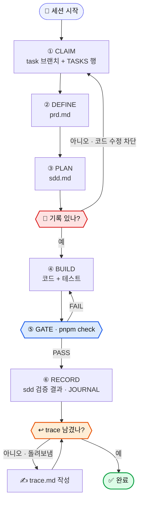
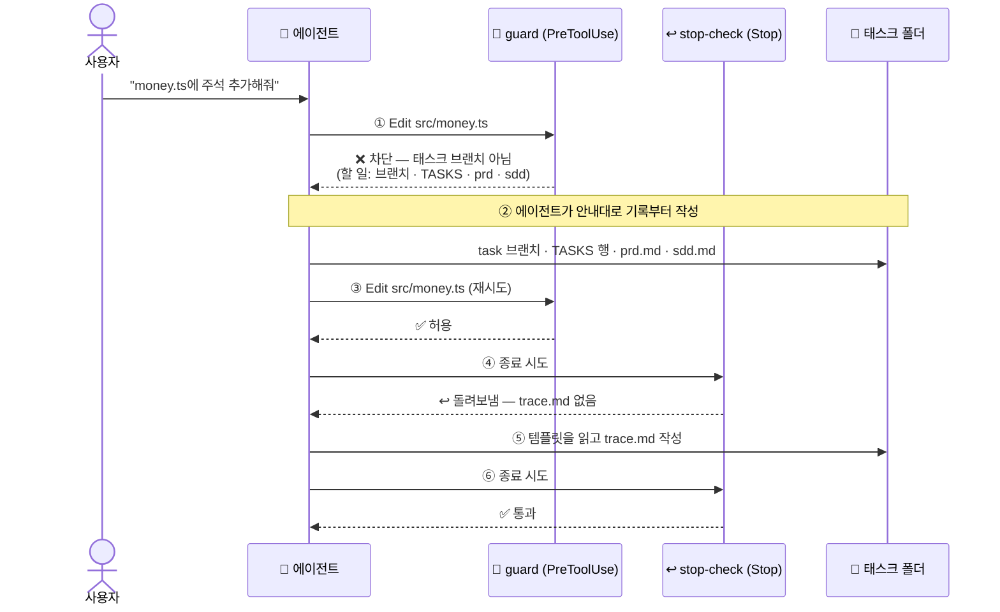

<div align="center">

# 🧪 harness-lab

**AI 코딩 에이전트가 "무엇을, 왜, 어떻게 했는지" 남기지 않고는 일을 끝낼 수 없게 만드는 하네스 실험실**

에이전트의 작업 과정을 기록으로 열고(블랙박스 해제), 그 기록을 hooks와 게이트로 강제합니다.

<br>


</div>

> [!NOTE]
> 이 저장소는 **제품이 아니라 하네스를 연구하고 공부하는 실험실**입니다. 쇼핑몰 할인·주문 엔진은 하네스를 시험하기 위한 **실험 대상 도메인**입니다.

---

## 📑 목차

[실험 현황](#-실험-현황) · [왜 만들었나](#-왜-만들었나) · [핵심 아이디어](#-핵심-아이디어) · [작업 루프](#-작업-루프) · [강제 장치](#%EF%B8%8F-강제-장치) · [태스크 기록](#-태스크-기록) · [발견한 것](#-발견한-것) · [실험 대상 도메인](#-실험-대상-도메인) · [저장소 구조](#%EF%B8%8F-저장소-구조) · [기술 스택](#-기술-스택) · [실행 방법](#%EF%B8%8F-실행-방법) · [로드맵](#%EF%B8%8F-로드맵)

---

## 📊 실험 현황

<sup>업데이트: **2026-09-29**</sup>

> **기록 강제까지 동작합니다** — 태스크 브랜치·TASKS·PRD·SDD 없이는 코드 수정이 막히고, trace 없이는 종료가 돌려보내집니다. 실제 Claude 세션(e2e)으로 확인했습니다.
> 다음 실험은 **평범한 기능 요청부터 끝까지 가는 대화형 전체 흐름** 관찰입니다.

| 영역 | 진행 |
| --- | --- |
| 🧪 하네스 실험 | **4 / 9 완료** · 1 다음 · 4 대기 |
| 🛡️ 강제 지점 | SessionStart · PreToolUse · Stop · 게이트 **4곳 동작** |
| ✅ 게이트 | 타입체크 · 단위 테스트 34개 · lockfile · 태스크 기록 **ALL PASS** |
| 🛒 도메인 | 장바구니·금액 계산 **구현** (쿠폰·주문 상태 미구현) |

### 실험별 상태

| 태스크 | 하네스 실험 | 상태 | PR |
| --- | --- | --- | --- |
| 0001 | 4계층 뼈대 + 완료 게이트 | ✅ 완료 | - |
| 0002 | 도메인 규칙 번호 ↔ 테스트 이름 추적 | ✅ 완료 | [#1](https://github.com/kyungchan3007/Harness/pull/1) |
| 0008 | PRD·SDD·Trace 분리 + hooks 자동 기록 | ✅ 완료 | [#2](https://github.com/kyungchan3007/Harness/pull/2) |
| 0009 | 기록 강제 (PreToolUse·Stop·게이트) | ✅ 완료 | [#3](https://github.com/kyungchan3007/Harness/pull/3) |
| - | 대화형 전체 흐름 관찰 | 🔜 다음 | - |
| 0003 | Intent — 모호한 spec에 되묻는가 (쿠폰 규칙) | ⬜ 대기 | - |
| 0005 | Eval — 속성 기반 테스트 게이트 (주문 상태) | ⬜ 대기 | - |
| 0006 | Orchestration — 서브에이전트 병렬 작업 | ⬜ 대기 | - |
| 0007 | CI에서 게이트 실행 | ⬜ 대기 | - |

<sup>범례: ✅ 완료 · 🔜 다음 · ⬜ 대기 · 문서 태스크(0010·0011 README)는 제외</sup>

---

## 💡 왜 만들었나

| 문제 | 이 저장소의 답 |
| --- | --- |
| 에이전트 작업 과정이 **블랙박스**다 | 태스크마다 `prd` · `sdd` · `trace` + hooks **자동 기록** |
| 기록 규칙을 문서에 써도 **건너뛴다** | hooks와 게이트로 **기록 없이는 수정·종료·완료 선언 불가** |
| 실제 프로젝트에서 실험하면 **작업 루프가 흔들린다** | 하네스만 따로 떼어 실험하는 **연구용 샌드박스** |
| 쉬운 도메인에선 에이전트가 **틀리지 않는다** | 함정이 많은 **쇼핑몰 할인·주문 엔진**을 실험 대상으로 |

---

## ✨ 핵심 아이디어

1. **🔍 블랙박스 열기** — 에이전트가 무엇을 읽고, 어디서 막히고, 무엇을 되돌렸는지를 태스크 폴더에 남깁니다.
2. **🛡️ 규칙이 아니라 장치로 강제** — "PRD 먼저 쓰세요"를 문서에 쓰는 대신, PRD 없이 코드를 고치면 **hook이 막습니다.**
3. **⚖️ 자기 보고 vs 사실 기록** — 에이전트가 쓴 `trace.md`와 hooks가 남긴 `trace.auto.jsonl`을 나란히 놓으면 **보고에서 빠진 헤맴**이 드러납니다.
4. **🔬 실험은 가설과 결론으로** — 실험마다 가설·결과를 [LEARNINGS.md](LEARNINGS.md)에 쌓습니다.

---

## 🔁 작업 루프

> **한 줄 요약** — 태스크를 점유하고 → PRD·SDD를 쓴 뒤에야 → 코드를 고칠 수 있고 → 게이트를 통과하고 → trace를 남겨야 끝낼 수 있습니다.

<table>
<tr>
<td width="360" valign="top">



</td>
<td valign="top">

**단계 (그림의 번호와 동일)**

1. **CLAIM** — `task/NNNN-슬러그` 브랜치를 만들고 `TASKS.md`에 행을 추가합니다.
2. **DEFINE** — `prd.md`에 왜·무엇·Acceptance를 씁니다.
3. **PLAN** — `sdd.md`에 접근·대안·검증 계획을 씁니다.
4. **BUILD** — 코드와 테스트를 작성합니다.
5. **GATE** — `pnpm check`가 PASS할 때까지 반복합니다.
6. **RECORD** — `sdd.md`에 계획과 달라진 점·검증 결과, JOURNAL에 한 줄.

**강제 지점 (그림의 색)**

| 색 | 지점 | 없으면 |
| --- | --- | --- |
| 🟥 | 🛑 코드 수정 직전 | 브랜치·TASKS·prd·sdd 없으면 **차단** |
| 🟦 | ⑤ 게이트 | 타입·테스트·기록 실패면 **FAIL** |
| 🟧 | ↩️ 종료 직전 | trace 없으면 **돌려보냄** |

**작업 내내 남는 기록**

| 기록 | 누가 |
| --- | --- |
| ✍️ `trace.md` — 판단·막힘·되돌림 | 에이전트 |
| 🤖 `trace.auto.jsonl` — 도구 호출 | hooks 자동 |

</td>
</tr>
</table>

---

## 🛡️ 강제 장치

> **한 줄 요약** — 네 지점에서 기록을 확인합니다. 판정 기준은 [`records.mjs`](agents/harness/hooks/lib/records.mjs) 한 곳에 있어 hook과 게이트가 어긋나지 않습니다.

| 지점 | 장치 | 확인하는 것 | 위반 시 |
| --- | --- | --- | --- |
| 🔔 세션 시작 | `session-context.mjs` | - | 현재 브랜치·태스크·기록 상태를 에이전트에게 주입 |
| 🛑 코드 수정 직전 | `guard.mjs` (PreToolUse) | 태스크 브랜치 + TASKS 행 + 채워진 prd·sdd | **수정 차단** + 해야 할 일 안내 |
| ↩️ 응답 종료 | `stop-check.mjs` (Stop) | 코드를 바꿨으면 trace.md 갱신 | **1회 돌려보냄** |
| ✅ 완료 선언 | `check-task-records.mjs` (게이트) | 모든 태스크의 기록 + 타입·테스트 | **`pnpm check` FAIL** |

### 실제로 에이전트가 겪는 흐름

아래는 실제 Claude 세션으로 돌린 e2e 결과를 그대로 옮긴 것입니다. ([원본 기록](agents/intent/specs/0009-record-enforcement/e2e/))



<sub>e2e는 두 시나리오로 나눠 확인했습니다: A(①의 차단) · B(③~⑥, prd·sdd가 있는 상태에서 시작).</sub>

- 🔓 **기록 경로는 항상 수정 가능** — `agents/intent/` · `agents/orchestration/` · `JOURNAL.md` · `LEARNINGS.md`. 그 밖은 모두 코드로 봅니다(하네스 파일 포함).
- 🧾 **템플릿 그대로면 미작성** — 제목 자리표시, 빈 Acceptance, 빈 접근·대안·검증 계획, 빈 trace 행을 잡아냅니다.
- ⚠️ **한계** — Bash로 쓰는 파일은 사전 차단 못 함(Stop·게이트가 사후에 잡음) · 기록의 **형식**만 검사.

---

## 📂 태스크 기록

태스크마다 `agents/intent/specs/NNNN-슬러그/` 폴더 하나에 네 가지 기록이 남습니다.

| 파일 | 질문 | 누가 | 언제 |
| --- | --- | --- | --- |
| `prd.md` | 왜, 무엇을 만드나 · Acceptance | ✍️ 에이전트 | 착수 전 |
| `sdd.md` | 어떻게 · 대안과 트레이드오프 · **계획과 달라진 점** · 검증 결과 | ✍️ 에이전트 | 착수 전 + 완료 시 |
| `trace.md` | 실제로 무슨 일이 있었나 (판단 · 막힘 · 되돌림) | ✍️ 에이전트 | 작업 내내 |
| `trace.auto.jsonl` | 무엇을 호출했나 (프롬프트 · 도구 · 성공/실패 · **차단**) | 🤖 Claude Code hooks | 도구 호출마다 |

### 자동 기록 예시

hooks가 남긴 실제 기록입니다. **차단된 순간**도 남습니다.

```jsonc
// 🛑 guard가 막은 코드 수정
{"event":"PreToolUse","tool":"Edit","detail":"src/money.ts","ok":false,"blocked":true,
 "error":"[기록 강제] src/money.ts 수정 차단: 현재 브랜치(exp-not-a-task)가 태스크 브랜치가 아닙니다."}

// ↩️ Stop이 돌려보낸 순간
{"event":"StopBlocked","ok":false,"blocked":true,
 "error":"agents/intent/specs/0042-e2e-stop/trace.md 가 없습니다 ..."}
```

`pnpm trace NNNN`으로 표로 요약해 볼 수 있습니다.

```
| 시각     | 이벤트            | 도구 | 내용                                  |
| 09:07:50 | PostToolUse       | Edit | src/money.ts                          |
| 09:07:53 | StopBlocked       |      | 🛑 차단 ❌ trace.md 가 없습니다 ...     |
| 09:08:10 | PostToolUse       | Write| agents/intent/specs/0042-.../trace.md |
| 09:08:16 | Stop              |      |                                       |
```

### 커밋·이슈·PR에 남기는 것

태스크 커밋에는 코드 변경과 함께 세 섹션을 남깁니다. 없으면 `commit-msg` hook이 커밋을 거부하고, 토큰 섹션은 `prepare-commit-msg` hook이 **transcript 실측값으로 자동으로** 채웁니다. ([지침서](agents/harness/commit-and-issue.md))

```
[허점]
- 커밋 전 메시지는 게이트가 볼 수 없어 hook으로만 강제된다

[보완]
- CI에서도 PR 커밋 메시지 검사

[컨텍스트·토큰]
- 범위: 브랜치 task/0017-commit-issue-guide 누적 · 세션 1개 · 요청 2회 · 모델 claude-haiku-4-5
- 토큰: 입력 18 · 캐시 쓰기 43.0k · 캐시 읽기 34.8k · 출력 432
- 컨텍스트: 최대 43.0k · 마지막 43.0k
- 읽은 파일: 1개
```

> 🔐 **public repo 대비** — 도구 결과(파일 내용·출력)는 남기지 않고, 비밀값 패턴은 `[REDACTED]`로 가리고, 경로는 상대 경로로 바꿔 200자로 자릅니다.

---

## 🔬 발견한 것

실험하면서 알게 된 것들입니다. 전체 목록: [LEARNINGS.md](LEARNINGS.md)

| # | 발견 | 조치 |
| --- | --- | --- |
| 1 | 쉬운 도메인(메모 CRUD)에선 에이전트가 틀리지 않아 **하네스 효과를 관찰할 수 없다** | 함정 많은 쇼핑몰 도메인으로 전환 |
| 2 | 게이트가 **있는 폴더만** 검사해서, 폴더를 아예 안 만들면 통과했다 | 태스크 브랜치면 폴더 존재부터 검사 |
| 3 | 차단된 호출에는 PostToolUse가 오지 않아 **가장 중요한 "막힘"이 기록에서 빠졌다** | hook이 차단할 때 직접 `blocked` 기록 |
| 4 | 에이전트는 **차단 메시지의 안내만 보고** 필요한 기록을 스스로 채웠다 | 차단 메시지에 "무엇을 하면 풀리는지"를 구체적으로 |
| 5 | 사후에 재구성한 trace는 **결과에 꿰맞춘 서술**이 된다 | 재구성 대신 누락 사실만 표기, 제도 도입 전 태스크에만 허용 |

---

## 🛒 실험 대상 도메인

**쇼핑몰 할인·주문 엔진** — 규칙이 얽히고 경계값이 많아 에이전트가 틀리기 쉬운 도메인입니다. 규칙의 단일 소스는 [domain.md](agents/context/domain.md)이고, 테스트 이름에 규칙 번호를 붙여 추적합니다.

| 규칙 | 내용 |
| --- | --- |
| 금액 | 항상 0 이상의 정수(원) |
| 수량 | 1~99, 같은 상품을 다시 담으면 합산 (99 초과 거부) |
| 배송비 | 3,000원, **할인 후** 50,000원 이상이면 무료 |
| 할인 | 0 이상, 상품 합계를 넘을 수 없음 |

```ts
priceCart([{ sku: "A", name: "상품", unitPrice: 52_000, quantity: 1 }], { discount: 2_001 });
// → { subtotal: 52000, discount: 2001, shipping: 3000, total: 52999 }
//   할인 후 49,999원 → 무료배송 기준 미달
```

---

## 🗂️ 저장소 구조

```
harness-lab/
├─ AGENTS.md · CLAUDE.md        # 🚪 에이전트 진입점 (항상 로드, 짧게)
├─ LEARNINGS.md                 # 🔬 실험 가설 · 결과
├─ src/                         # 🛒 실험 대상 도메인 (장바구니 · 금액 계산)
├─ .claude/settings.json        # 🪝 hooks 등록
└─ agents/
   ├─ intent/                   # 🎯 무엇을 만드나
   │  ├─ specs/NNNN-*/          #    prd · sdd · trace · trace.auto.jsonl
   │  └─ templates/             #    prd · sdd · trace 템플릿
   ├─ context/                  # 📚 무엇이 참인가 (architecture · domain)
   ├─ harness/                  # ⚙️ 어떻게 안전하게 돌리나
   │  ├─ hooks/                 #    trace · guard · stop-check · session-context
   │  └─ evals/                 #    완료 게이트
   ├─ orchestration/TASKS.md    # 📋 작업 보드
   └─ JOURNAL.md                # 🗒️ 태스크 목차
```

| 계층 | 동사 | 문서 |
| --- | --- | --- |
| Intent | 정의한다 | [templates](agents/intent/templates/) |
| Context | 안다 | [architecture](agents/context/architecture.md) · [domain](agents/context/domain.md) |
| Harness | 실행한다 | [loop](agents/harness/loop.md) · [guardrails](agents/harness/guardrails.md) · [observability](agents/harness/observability.md) |
| Orchestration | 엮는다 | [TASKS](agents/orchestration/TASKS.md) |

---

## 🧱 기술 스택

| 구분 | 기술 | 역할 |
| --- | --- | --- |
| 언어 | TypeScript (strict · ESM) | 도메인 코드 |
| 런타임 | Node.js 22 | hooks · 게이트 스크립트 (의존성 없는 `.mjs`) |
| 테스트 | Vitest | 도메인 규칙 · hook 판정 로직 (임시 git repo로 검증) |
| 에이전트 | Claude Code · Codex | `AGENTS.md` 단일 진입점을 공유 |
| 하네스 | Claude Code hooks | SessionStart · UserPromptSubmit · PreToolUse · PostToolUse · PostToolUseFailure · Stop |
| 패키지 | pnpm | 다른 lockfile은 게이트에서 차단 |

---

## ▶️ 실행 방법

```bash
pnpm install
pnpm check        # 완료 게이트: 타입 · 테스트 · lockfile · 태스크 기록
pnpm trace 0009   # 태스크의 hooks 자동 기록 요약
pnpm usage        # 현재 태스크 브랜치의 토큰·컨텍스트 사용량 (transcript 실측)
```

hooks는 **이 폴더에서 Claude Code 세션을 열면** 자동으로 동작합니다 ([.claude/settings.json](.claude/settings.json)).
새 작업은 `task/NNNN-슬러그` 브랜치와 [템플릿](agents/intent/templates/)부터 시작하세요. 그렇지 않으면 hook이 막습니다.

---

## 🗺️ 로드맵

| # | 실험 | 계층 | 상태 |
| --- | --- | --- | --- |
| 1 | 4계층 뼈대 + 완료 게이트 | 전체 | ✅ 완료 |
| 2 | 과정 기록 (PRD·SDD·Trace + hooks 자동 기록) | Observability | ✅ 완료 |
| 3 | 기록 강제 (PreToolUse·Stop·게이트) | Guardrails · Eval | ✅ 완료 |
| 4 | 대화형 전체 흐름 관찰 | 검증 | 🔜 다음 |
| 5 | 모호한 spec에 되묻는가 (쿠폰 규칙) | Intent | ⬜ 대기 |
| 6 | 속성 기반 테스트 게이트 (주문 상태) | Eval | ⬜ 대기 |
| 7 | 서브에이전트 병렬 작업 (할인·배송 분리) | Orchestration | ⬜ 대기 |
| 8 | CI에서 게이트 실행 | Eval | ⬜ 대기 |
| 9 | 기록 **내용 품질** 판정 (LLM-as-judge) | Eval | ⬜ 대기 |

---

<div align="center">
<sub>🤖 이 저장소도 자신이 실험하는 하네스(<a href="AGENTS.md">AGENTS.md</a>) 규칙을 따라 Claude Code로 개발됩니다 — 모든 변경은 태스크 폴더에 기록이 남습니다.</sub>
</div>
