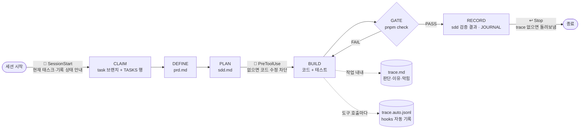

# 🧪 harness-lab

> AI 코딩 에이전트가 **무엇을, 왜, 어떻게 했는지** 남기지 않고는 일을 끝낼 수 없게 만드는 하네스 실험실


---

## 왜 만들었나

| 문제 | 이 repo의 답 |
| --- | --- |
| 에이전트 작업 과정이 **블랙박스**다 | 태스크마다 `prd` · `sdd` · `trace` + hooks 자동 기록 |
| 기록 규칙을 문서에 써도 **건너뛴다** | hooks와 게이트로 **기록 없이는 코드 수정·종료·완료 선언 불가** |
| 실제 프로젝트에서 실험하면 **작업 루프가 흔들린다** | 별도 샌드박스에서 검증하고, 효과가 확인된 것만 실제 프로젝트(ClauseLens)로 옮긴다 |
| 쉬운 도메인에선 에이전트가 **틀리지 않아** 하네스 효과를 볼 수 없다 | 함정이 많은 **쇼핑몰 할인·주문 엔진**을 실험 대상으로 |

## 한눈에 보는 작업 루프



## 태스크마다 남는 기록

`agents/intent/specs/NNNN-슬러그/`

| 파일 | 질문 | 누가 | 언제 |
| --- | --- | --- | --- |
| `prd.md` | 왜, 무엇을 만드나 · Acceptance | 에이전트 | 착수 전 |
| `sdd.md` | 어떻게 · 대안과 트레이드오프 · **계획과 달라진 점** · 검증 결과 | 에이전트 | 착수 전 + 완료 시 |
| `trace.md` | 실제로 무슨 일이 있었나 (판단·막힘·되돌림) | 에이전트 | 작업 내내 |
| `trace.auto.jsonl` | 무엇을 호출했나 (프롬프트·도구·성공/실패·차단) | Claude Code hooks | 도구 호출마다 |

> 💡 `trace.md`(자기 보고)와 `trace.auto.jsonl`(사실 기록)을 나란히 보면 **에이전트가 보고에서 빠뜨린 헤맴**이 드러납니다.

## 강제 장치

| 지점 | 장치 | 조건 | 위반 시 |
| --- | --- | --- | --- |
| 🔔 세션 시작 | `session-context.mjs` | - | 현재 브랜치·태스크·기록 상태를 에이전트에게 주입 |
| 🛑 코드 수정 직전 | `guard.mjs` (PreToolUse) | 태스크 브랜치 + TASKS 행 + 채워진 prd·sdd | **수정 차단** + 해야 할 일 안내 |
| ↩️ 응답 종료 | `stop-check.mjs` (Stop) | 코드를 바꿨으면 trace.md 갱신 | **1회 돌려보냄** |
| ✅ 완료 선언 | `pnpm check` (게이트) | 모든 태스크 폴더의 기록 + 타입·테스트 | **FAIL** |

- 판정 기준은 [`hooks/lib/records.mjs`](agents/harness/hooks/lib/records.mjs) 한 곳에 있어 hook과 게이트가 어긋나지 않습니다.
- 템플릿을 그대로 두면 "미작성"으로 판정합니다.
- 한계: Bash로 쓰는 파일은 사전 차단 못 함(Stop·게이트가 사후에 잡음), 기록 **형식**만 검사.

## 실험 현황

| 태스크 | 하네스 실험 | 도메인 작업 | 상태 | 결과 |
| --- | --- | --- | --- | --- |
| [0001](agents/intent/specs/0001-bootstrap/) | 4계층 뼈대 + 완료 게이트 | - | ✅ | ClauseLens 구조를 축소해도 루프 성립 |
| [0002](agents/intent/specs/0002-cart-pricing/) | 규칙 번호 ↔ 테스트 이름 추적 | 장바구니·금액 계산 | ✅ | 사람이 읽기엔 효과, 누락은 게이트가 못 잡음 |
| [0008](agents/intent/specs/0008-trace-observability/) | PRD·SDD·Trace 분리 + hooks 자동 기록 | - | ✅ | 파이프라인 동작, 비밀값 마스킹 확인 |
| [0009](agents/intent/specs/0009-record-enforcement/) | 기록 강제 (PreToolUse·Stop·게이트) | - | ✅ | e2e: 차단 안내만 보고 에이전트가 스스로 기록을 채움 |
| [0010](agents/intent/specs/0010-readme/) | README 정리 | - | ✅ | |
| 0003 | Intent: 모호한 spec에 되묻는가 | 쿠폰 규칙 | ⏳ | |
| 0005 | Eval: 속성 기반 테스트 게이트 | 주문 상태 흐름 | ⏳ | |
| 0006 | Orchestration: 서브에이전트 병렬 | 할인·배송 분리 | ⏳ | |
| 0007 | CI에서 게이트 실행 | - | ⏳ | |

전체 결과와 ClauseLens 적용 여부: [LEARNINGS.md](LEARNINGS.md) · 작업 보드: [TASKS.md](agents/orchestration/TASKS.md)

## 빠른 시작

```bash
pnpm install
pnpm check        # 완료 게이트: 타입 · 테스트 · lockfile · 태스크 기록
pnpm trace 0009   # 태스크의 hooks 자동 기록 요약
```

hooks는 **이 폴더에서 Claude Code 세션을 열면** 자동으로 동작합니다 ([.claude/settings.json](.claude/settings.json)).

## 구조

```
harness-lab/
├── AGENTS.md / CLAUDE.md        에이전트 진입점 (항상 로드, 짧게)
├── LEARNINGS.md                 실험 결과 · ClauseLens 적용 여부
├── src/                         실험 대상 도메인 (장바구니 · 금액 계산)
├── .claude/settings.json        hooks 등록
└── agents/
    ├── intent/                  무엇을 만드나
    │   ├── specs/NNNN-*/        prd · sdd · trace · trace.auto.jsonl
    │   └── templates/           prd · sdd · trace 템플릿
    ├── context/                 무엇이 참인가 (architecture · domain 규칙)
    ├── harness/                 어떻게 안전하게 돌리나
    │   ├── hooks/               trace · guard · stop-check · session-context
    │   └── evals/               완료 게이트
    ├── orchestration/TASKS.md   작업 보드
    └── JOURNAL.md               태스크 목차
```

| 계층 | 한 단어 | 문서 |
| --- | --- | --- |
| Intent | 정의한다 | [templates](agents/intent/templates/) |
| Context | 안다 | [architecture](agents/context/architecture.md) · [domain](agents/context/domain.md) |
| Harness | 실행한다 | [loop](agents/harness/loop.md) · [guardrails](agents/harness/guardrails.md) · [observability](agents/harness/observability.md) |
| Orchestration | 엮는다 | [TASKS](agents/orchestration/TASKS.md) |
