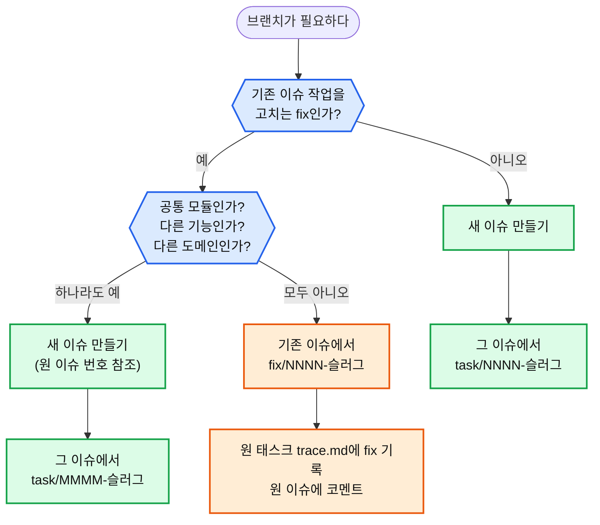

# 이슈·브랜치 지침서 — 모든 브랜치는 이슈에서

브랜치는 **반드시 GitHub 이슈에서 만들고 연결**합니다. 이슈가 "왜 시작했고 어디까지 됐는지"의 단일 창구가 되게 하기 위해서입니다.

## 규칙

| 상황 | 이슈 | 브랜치 | 기록 |
| --- | --- | --- | --- |
| **새 작업** | 새 이슈 | 그 이슈에서 `task/NNNN-슬러그` | 새 태스크 폴더 `specs/NNNN-*/` |
| **기존 이슈 작업의 fix** (같은 기능·같은 도메인) | ❌ 새로 만들지 않음 | **기존 이슈**에서 `fix/NNNN-슬러그` (NNNN = 원 태스크 번호) | 원 태스크의 `trace.md`에 fix 행 추가 + 원 이슈에 코멘트 |
| **fix 중 나온 다른 성격의 작업** (공통 모듈·다른 기능·다른 도메인) | ✅ 새 이슈 (원 이슈 번호 참조) | **새 이슈**에서 `task/MMMM-슬러그` | 새 태스크 폴더 |

## 판단 흐름



**fix인지 새 이슈인지 헷갈릴 때 — 세 질문**
1. 고치다 보니 **여러 곳이 쓰는 공통 모듈**(예: `money.ts`, hooks 공용 lib)을 바꾸게 됐나?
2. 원 이슈의 Acceptance에 **없는 기능**을 추가하게 됐나?
3. 원 작업과 **다른 도메인**(예: 가격 계산 작업 중 주문 상태)을 건드리게 됐나?

하나라도 "예"면 새 이슈입니다. fix에 섞으면 원 이슈의 범위가 흐려지고, 공통 모듈 변경이 fix 속에 묻혀 리뷰에서 놓칩니다.

## 명령

```bash
# 새 작업
gh issue create --title "[NNNN] 제목" --body-file <본문>      # 템플릿: .github/ISSUE_TEMPLATE/task.md
gh issue develop <이슈번호> --name task/NNNN-슬러그 --base main --checkout

# 기존 이슈의 fix
gh issue develop <원 이슈번호> --name fix/NNNN-슬러그 --base main --checkout
gh issue comment <원 이슈번호> --body "fix: <무엇을 왜> (브랜치 fix/NNNN-슬러그)"

# PR 전에 연결·체크박스 확인 (prd.md Acceptance가 원본, 이슈는 복사본)
pnpm issue-link          # 브랜치 ↔ 이슈 연결
pnpm issue-sync          # 이슈 체크박스를 prd에 맞춤
pnpm issue-sync --check  # 어긋나면 실패

# 머지 후 — "Closes #N"이 이슈를 닫지 못하는 경우가 있다 (0021에서 실제 발생)
pnpm issue-sync --close  # PR이 합쳐졌는데 이슈가 열려 있으면 닫음 (사유 없는 미체크가 있으면 거부)
```

**체크박스 규칙:** 완료 조건의 원본은 `prd.md`의 `## Acceptance` 하나다. 이슈는 `pnpm issue-sync`로 복사한다. 작업 보드에서 done인 작업은 prd에 **사유 없는 미체크**가 있으면 완료 검사가 실패한다 — 못 한 항목은 `- [ ] … (후속 #번호)`처럼 사유를 적는다.

## 하네스가 강제하는 것

| 장치 | 내용 |
| --- | --- |
| guard · 게이트 | 0021 이후 태스크는 `prd.md`에 `- **이슈:** #번호`가 없으면 코드 수정 차단 · `pnpm check` FAIL |
| `fix/NNNN-*` 인식 | guard·Stop·게이트·커밋 규칙·자동 기록이 fix 브랜치를 원 태스크(NNNN)로 본다 |
| `pnpm issue-link` | 현재 브랜치가 prd의 이슈에 **실제로 연결**됐는지 GitHub로 확인 (네트워크 필요 → PR 전에 실행) |

## 한계

- 이슈 연결 여부는 GitHub에만 있어 오프라인 게이트로는 확인할 수 없다 → `pnpm issue-link`를 PR 전에 실행.
- fix와 새 이슈의 경계(세 질문)는 사람·에이전트의 판단이다. 기계가 판정하지 않는다.
- 0001~0019는 이 규칙 이전 태스크라 이슈가 없다(면제).
